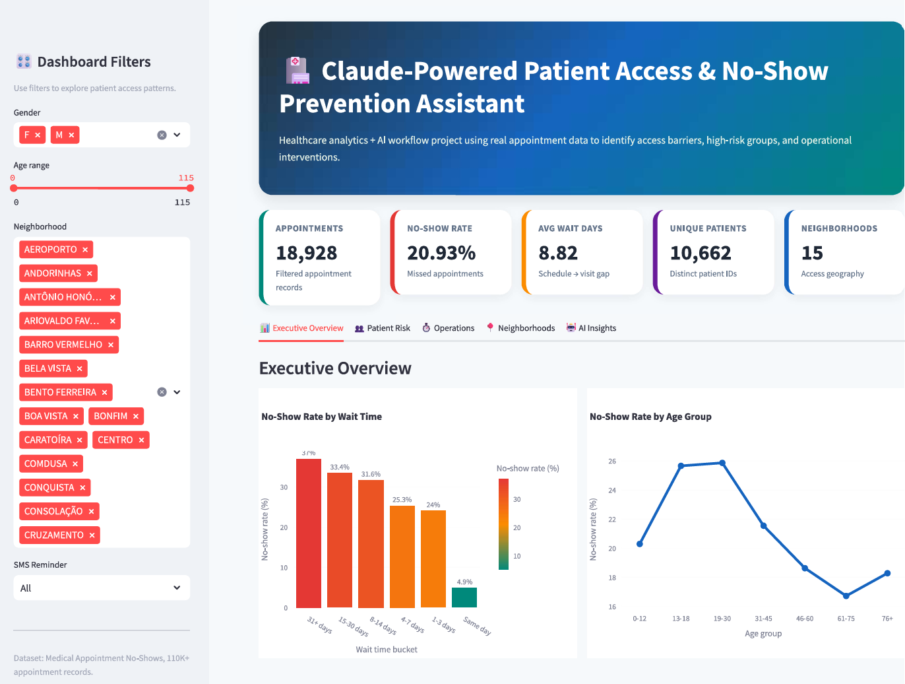
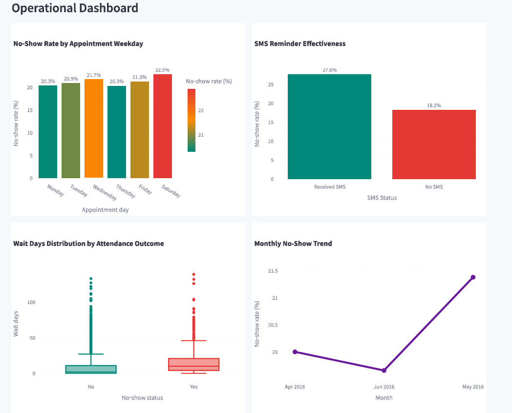
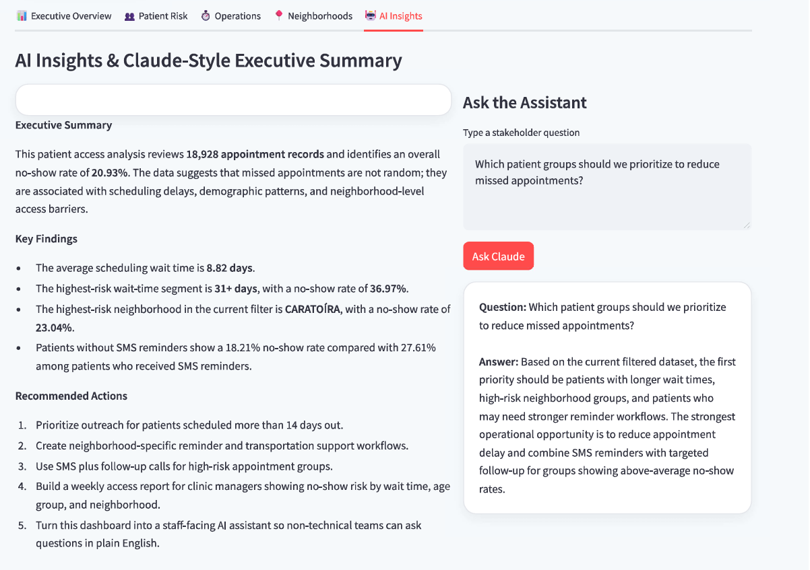

# Claude-Powered Patient Access & No-Show Prevention Assistant

## Project Impact

- Analyzed 110,526 healthcare appointment records
- Identified 20.19% overall no-show rate
- Identified 36.97% no-show risk among patients waiting 31+ days
- Identified neighborhoods exceeding 23% no-show rates
- Built AI-assisted healthcare analytics dashboards for stakeholder decision-making

## Dashboard Screenshots

### Executive Overview

### Operations Dashboard

### AI Insights Dashboard

## Overview

This project analyzes over 110,000 real-world healthcare appointment records to identify patient no-show patterns, access barriers, and operational improvement opportunities.

The dashboard was designed to demonstrate how AI-assisted analytics can help healthcare organizations translate operational data into actionable insights for clinic leaders, care coordinators, and public-health stakeholders.

## Why This Project Fits Claude Corps

Claude Corps focuses on helping organizations use AI to solve real operational challenges.

This project demonstrates how AI-assisted workflows can:

* Identify patient access barriers
* Surface high-risk populations
* Generate stakeholder-ready summaries
* Translate complex healthcare data into plain-language recommendations
* Support non-technical decision-makers

The project combines healthcare analytics, public-health problem solving, data visualization, and AI-inspired reporting workflows.

## Dataset

Medical Appointment No-Shows Dataset (Kaggle)

* 110,526 appointment records
* 62,299 unique patients
* 81 neighborhoods
* Real-world healthcare scheduling data

## Key Metrics

* Total appointments
* Unique patients
* No-show rate
* Wait-time analysis
* Age-group risk analysis
* SMS reminder effectiveness
* Diabetes and hypertension risk analysis
* Neighborhood-level access patterns
* Monthly attendance trends

## Technology Stack

* Python
* Streamlit
* Pandas
* NumPy
* Plotly
* Scikit-learn

## Future Enhancements

* Claude API integration for natural-language healthcare analytics
* Predictive no-show risk modeling
* Automated intervention recommendations
* Executive report generation
* Conversational healthcare assistant
